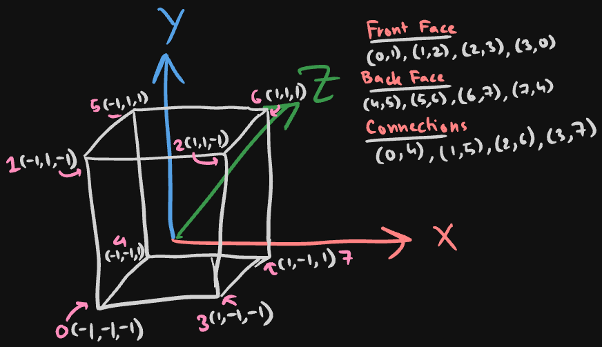
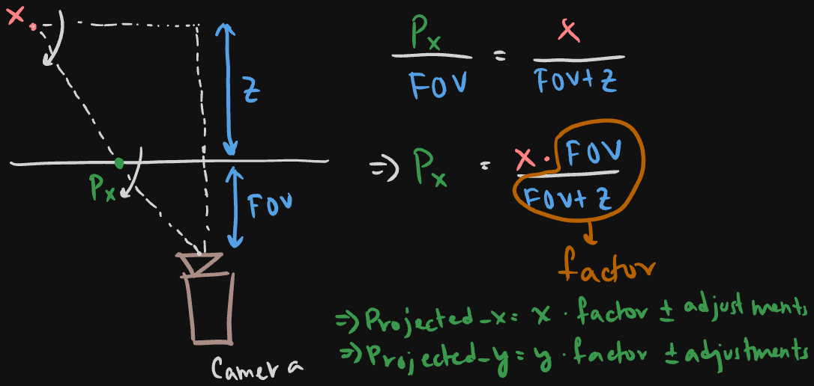
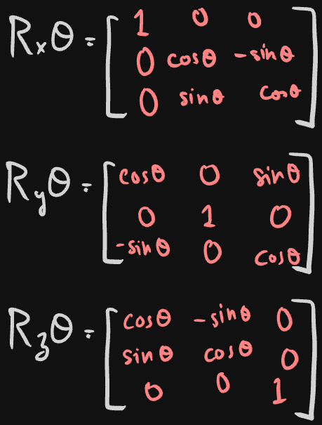
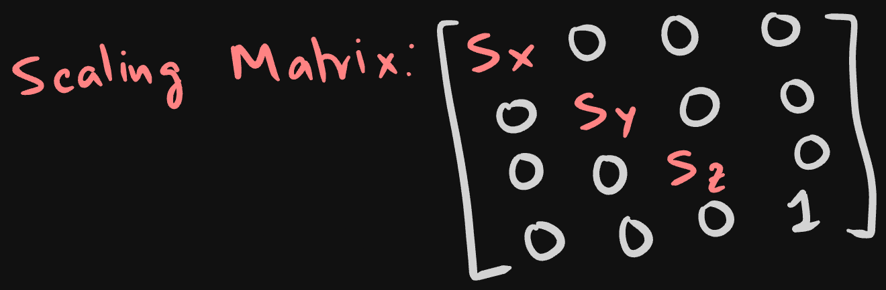
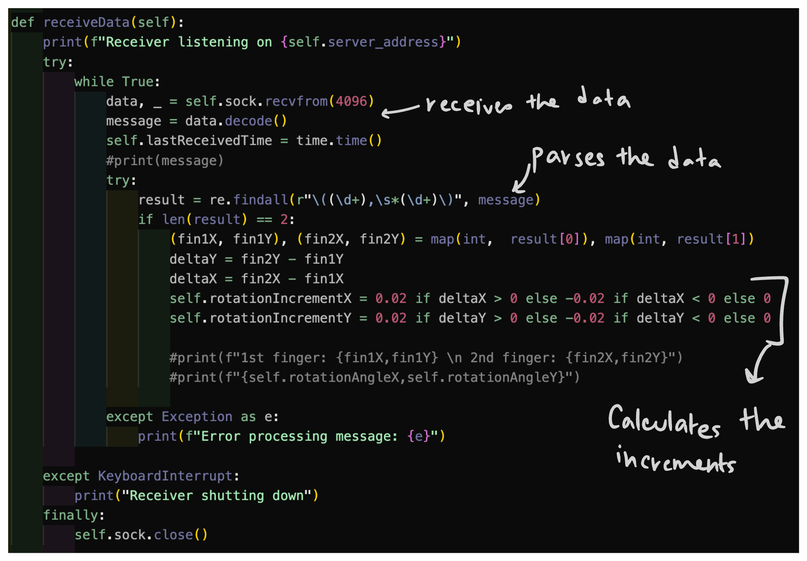

# HandSim
## Introduction

HandSim is a project that simulates hand detection and interactions with a 3D environment. This repository includes a variety of utilities for detecting hands and visualizing interactions with objects like cubes.
## Table of Contents

1. [Project Overview](#project-overview)
2. [Installation](#installation)
3. [Methodology](#methodology)
4. [Usage](#usage)
5. [Results](#results)
6. [Future Directions](#future-directions)
7. [Contributions](#contributing)
8. [License](#license)


## Project-Overview
HandSim employs mediapipe Hand tracking and a 3d renderer to read various hand positions and translate them to movements in a 3D environment through a specific port.

The project is divided into three main parts:
1. Hand detection and tracking of thumb and index finger(optional cube projection on cv2 window)

2. Cube Simulation and rotation/scaling using a 3d renderer

3. Communication between both programs using udp packets and the socket library
## Installation

```bash
git clone https://github.com/greyvoidbloom/HandSim.git
cd HandSim
```
## Methodology
### Part 1: Hand Detection and Plotting using OpenCV and MediaPipe
This program deploys a cv2 window connected to the first webcam connected to the device.

This also has a bunch of proprietary functions:
```python
#this function maps and draws a cuboid to your thumb and index finger with them being the opposite vertexes of the cube
self.drawCuboid(frame=processedFrame, startFinger=self.thumbFinger, endFinger=self.indexFinger, color=self.cubeColor)
#this function processes the frames for cv2 lol
processedFrame = self.processFrame(frame=frame)
#this function takes location of two tuples, start finger and end finger, and then forwards it over a server and port
self.sendCoords(self.thumbFinger, self.indexFinger)
```
### Part 2: Cube Simulation
The cube simulation has a few steps:

The cube vertices and edges need to be initialised:

These vertices need to be projected from 3D to 2D screen:
We calculate that using fov and the z distance to return values of x and y(2D screen)

#### Projection Calculation:


Currently, these cubes only perform rotation around the x and y axis.

This is acheived through totation matrices:
The current vertices and the rotation matrixes are dot producted with each other given specific angles:



It can also be scaled with the scale Matrix:



#### Communication:
Now, the Rotation of the cube is controlled by the receiveData() method. This method takes data recived, and parses it and determines the rotation increments based on that.

## Usage
You will need two terminals for this.
Make youre you're within the HandSim directory.


First terminal:
```bash
cd hand\ detection/
python3 hand_detection.py
```
Second Terminal:
```bash
cd pyCubeSim/
python3 vizCube.py
```
## Results:
https://github.com/user-attachments/assets/812ebb77-9d61-42b7-b5d7-ba179adf2a43

## Future Directions
- Rewrite the enngine in cpp
- Optimise everything
- Fine tune hand movements, add scaling option
- Add functionality to add any 3D Models

## Contributing

Pull requests are welcome. For major changes, please open an issue first
to discuss what you would like to change.

Please make sure to update tests as appropriate.

## License

[MIT](LICENSE)